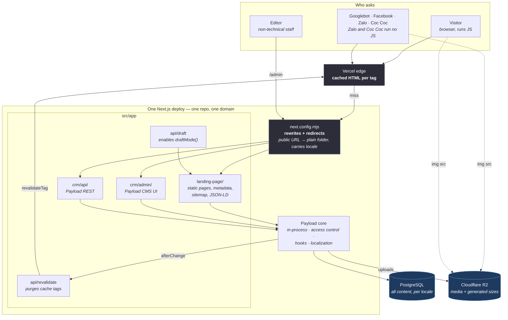
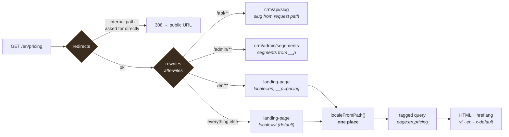
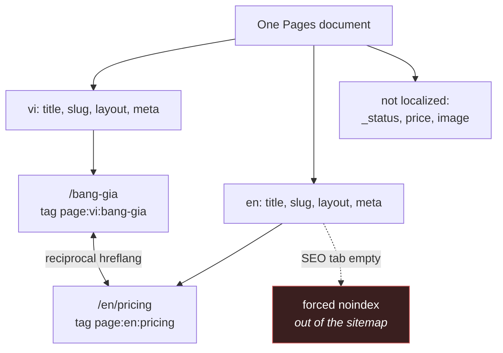
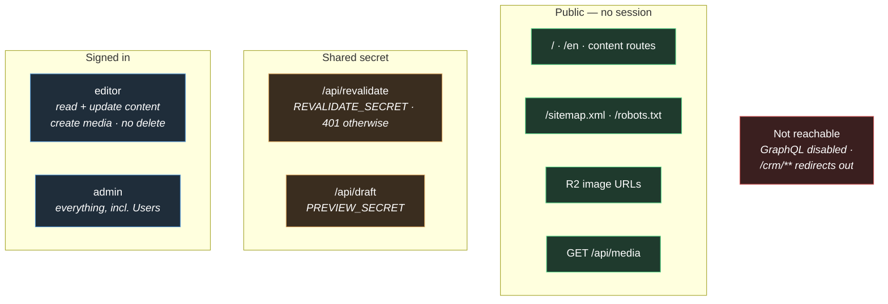

# Architecture diagram

Companion to [`Design.md`](./Design.md). That file is the source of truth;
this one is the same architecture drawn, so the shape is visible at a glance.
If they disagree, `Design.md` wins and this file is stale.

Diagrams are Mermaid, which GitHub renders inline.

---

## 1. System

One Next.js deploy, two external stores. The CMS is **not** a separate
service: `/admin` and the public pages run in the same process, which is why
a content change needs no build.

**Why images bypass the deploy.** `disablePayloadAccessControl` makes
`next/image` and crawlers fetch straight from R2's public host. Proxying the
media library through the Next server would put every image on the critical
path for LCP, and AGENT.md section 5.5 targets mobile Lighthouse at 90.

---

## 2. How a URL becomes a page

Route folders under `src/app` are plain words, so the filesystem does not
produce the public URLs — the rewrite table does. The locale rides along the
same mechanism that already carries path depth.

**The cost, stated plainly.** Every route added from here needs a rule in
this table, in both locales, or it 404s while the build still passes — which
is why the e2e suite walks the table rather than trusting it. And
`generateStaticParams()` cannot prerender per slug behind a literal folder
name, which localization multiplies by the number of locales. See
`Design.md` section 5a: **decide this before T-09.**

---

## 3. Locales

| | `vi` (default) | `en` |
| --- | --- | --- |
| URL | unprefixed — `/bang-gia` | `/en` prefix — `/en/pricing` |
| Slug | localized, its own keyword | localized, its own keyword |
| Cache tag | `page:vi:bang-gia` | `page:en:pricing` |
| `og:locale` | `vi_VN` | `en_US` |
| `hreflang` | `vi` + `x-default` | `en` |

An untranslated locale is **excluded, not published**. Payload's field
fallback would otherwise render Vietnamese text under an `/en/` URL — thin
duplicate content competing with the page it was copied from. The guard
reuses `meta.noindex`, which T-13 already honours, so there is no new
concept for the handover to explain.

---

## 4. Trust boundaries

What is reachable without a session, and what each control actually is.

Two of these are load-bearing and were found by testing, not by reading:

- **Media must be publicly readable.** Payload's default denies anonymous
  reads, which 403s every image for visitors and crawlers alike.
- **The last administrator cannot be removed.** `role` is admin-only at
  field level and `Users` is hidden from editors, so zero admins means
  nobody can promote anyone and only SQL recovers it.
