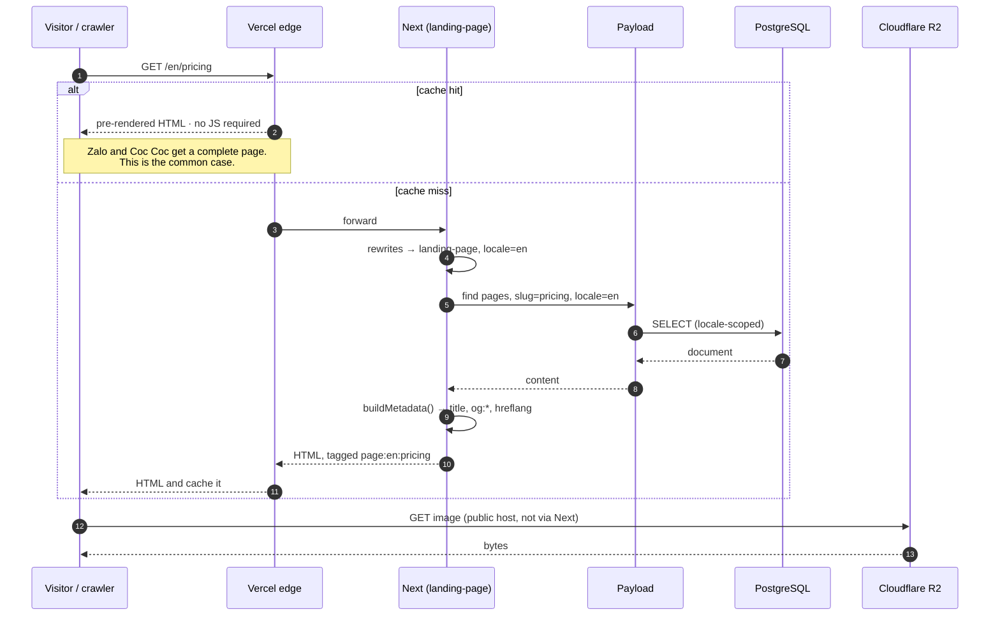
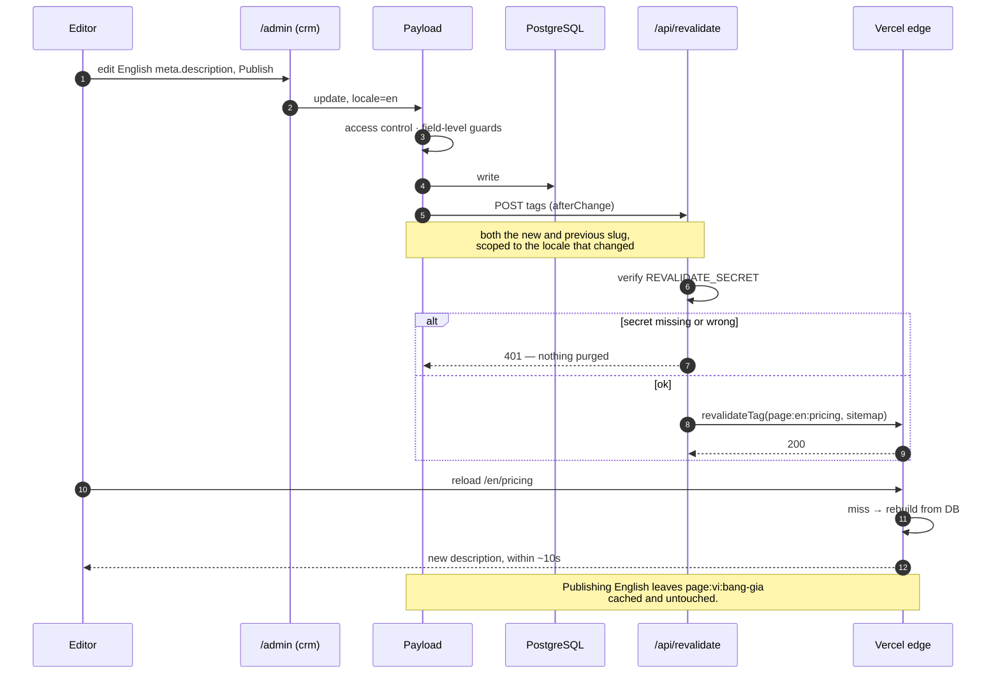
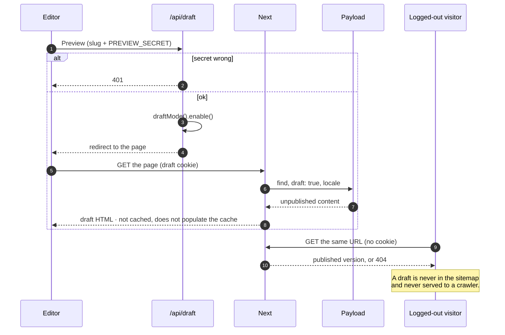
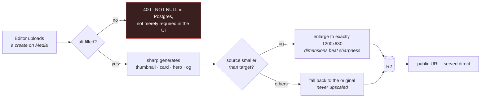

# Flow diagram

Companion to [`Design.md`](./Design.md) section 1.2. The read path and the
write path are independent, and that independence is the whole point of the
architecture: it is why a non-developer can change a meta description and
see it live in seconds, with no build.

If this file and `Design.md` disagree, `Design.md` wins.

---

## 1. Read path — visitor or crawler

**What can go wrong here**

| Symptom | First thing to check |
| --- | --- |
| Page renders but is empty for a crawler | content fetched in a client component or `useEffect` |
| Share on Zalo has no image | `metadataBase` missing, so `og:image` is relative |
| New route 404s though the build passed | no rewrite rule for it, in either locale |
| English URL shows Vietnamese text | locale not resolved; field fallback filling in |
| Route shows `ƒ` not `○` in the build | not statically generated — see `Design.md` 5a |

---

## 2. Write path — editor publishes

No CI run is involved. A content change never triggers a build.

**Why the hook never blocks the save.** A failed purge is logged and
swallowed; the `revalidate: 3600` floor is the safety net, so the worst case
is a stale page for an hour rather than an editor who cannot publish.

**What can go wrong here**

| Symptom | First thing to check |
| --- | --- |
| Edit does not appear live | the query feeding that page has no tag, so there is nothing to purge |
| Old URL still serves after a slug change | `afterChange` not sending `previousDoc.slug` |
| Vietnamese page went stale after an English edit | tag missing its locale — purging too broadly |
| Edit appears only after an hour | the webhook is failing; the floor is covering for it |

---

## 3. Draft preview

The one case that deliberately bypasses the cache, scoped to a cookie
holder.

---

## 4. Upload

Left to its default, Payload **omits** a size larger than the source and
says nothing — a 600x400 upload produced no `og` at all, meaning no
Facebook or Zalo preview image. Every size now sets `withoutEnlargement`
explicitly.

---

## 5. Where the gates sit

```mermaid
graph LR
    subgraph p1["Phase 1"]
        t1["T-01 bootstrap"] --> t4["T-04 deploy"]
        t1 --> t4a["<b>T-04A localization</b>"]
    end
    g1{{"Gate 1<br/>login · green deploy ·<br/>both locales"}}
    subgraph p2["Phase 2 — content and SEO"]
        t6["T-06/07 collections"] --> t8["T-08 SEO group"] --> t9["T-09 buildMetadata"] --> t10["T-10 cache tags"] --> t14["T-14 JSON-LD"]
    end
    g2{{"Gate 2<br/>meta + hreflang + JSON-LD<br/>in both locales"}}
    subgraph p3["Phase 3 — interface"]
        t15a["T-15A catalog"] --> t17["T-17 blocks"] --> t20["T-20 performance"]
    end
    g3{{"Gate 3<br/>mobile Lighthouse 90+"}}
    subgraph p4["Phase 4 — launch"]
        t23["T-23 seed"] --> t24["T-24 handover"]
    end
    g4{{"Gate 4<br/>indexed · editor publishes unaided"}}

    t4 --> g1
    t4a --> g1
    g1 --> t6
    t14 --> g2
    g2 --> t15a
    t20 --> g3
    g3 --> t23
    t24 --> g4

    classDef gate fill:#3a2d1f,stroke:#d5a05b,color:#fff
    class g1,g2,g3,g4 gate
```

Each arrow into a gate is a thing that cannot be retrofitted cheaply:
**T-04A** fixes the schema, the cache key and the routing; **Phase 2** makes
SEO a property of the data layer; **T-15A** gives interface strings a home
before the components exist. Reordering any of them turns the next phase
into extraction work.
